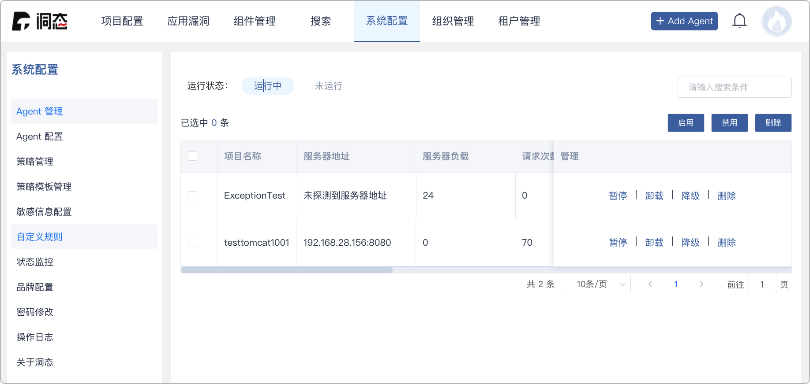
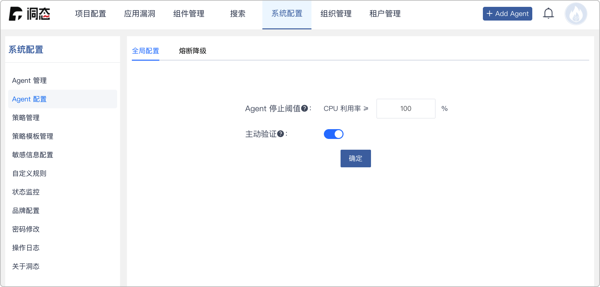
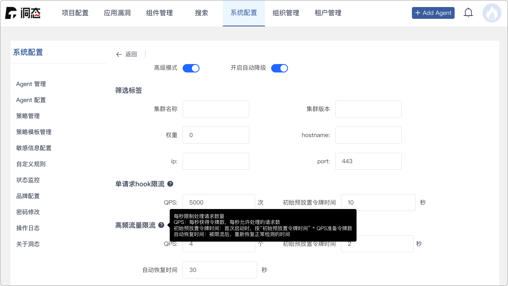
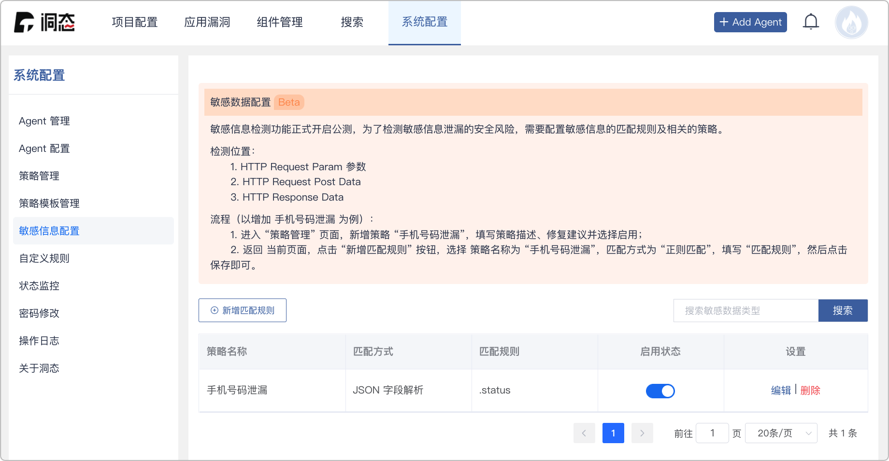
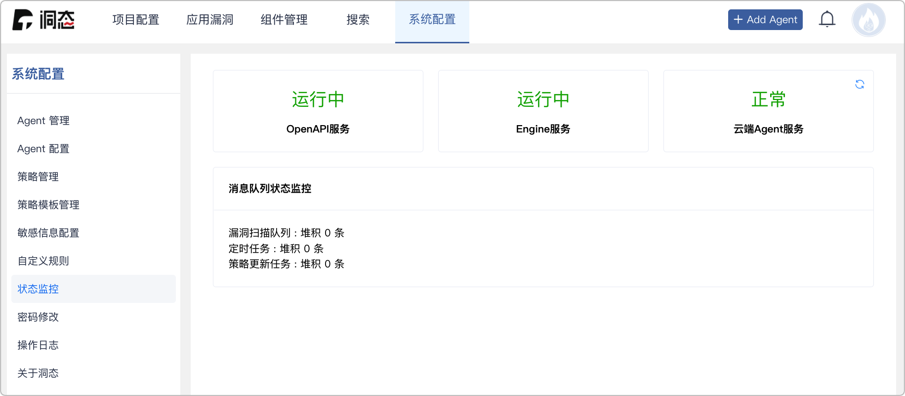
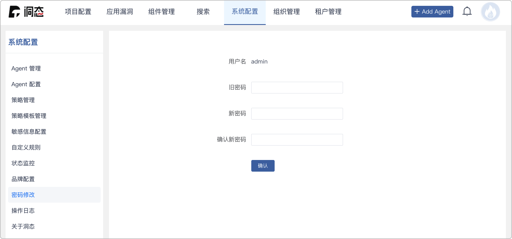
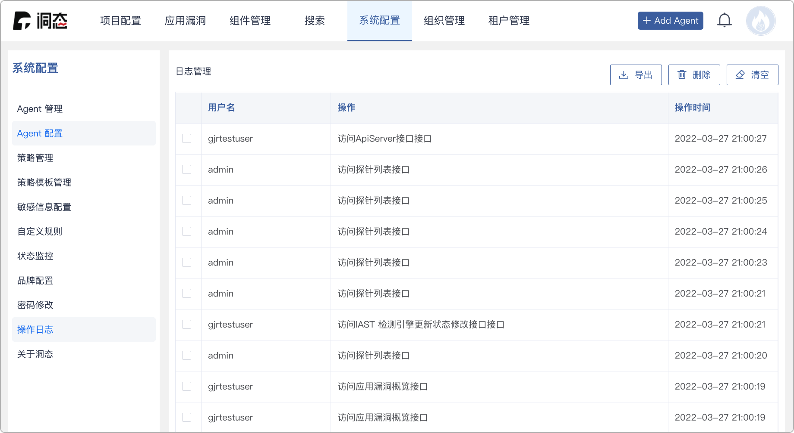

# 系统配置

系统配置在上方菜单栏的左边第五个，收录 DongTai IAST 的配置。其子功能如下：

## Agent 管理

* 用来对 Agent 进行查看、管理和监控。

* 根据运行状态分为 `运行中 Agent` 和 `未运行 Agent`。

* Agent 管理的功能

	* 开启 Agent : 开开启核心检测引擎，开启数据上报。

	* 禁用 Agent : 禁用核心检测引擎，关闭 Agent 端的数据采集，关闭除了心跳之外的数据上报。

	* 卸载 Agent : 把应用的 Agent 卸载掉。

	* 注册 Agent : 将已卸载 Agent 的应用重新加载 Agent。

	* 恢复 Agent : 当遇到熔断时，强制恢复 Agent 的运作（暂时性）。

	* 删除 Agent : 删除 Agent 所产生的数据。

	:::tip

	支持对 Agent 进行批量`启用`、`禁用`、`删除`。

	:::

## Agent 配置

### 全局配置

* 停止阈值以及主动验证设定。

* 停止阈值 : 当CPU利用率满足阈值条件时，Agent自动停止。当CPU利用率低于阈值条件时，Agent自动启动。

	:::tip

	此阈值条件只有系统超级使用者能设定。

	:::

* 主动验证 : 用于验证存在污点调用链的漏洞是否真实有效。

	:::tip

	主动验证时，Engine 自动识别攻击参数位置，并构造 payload。

	然后从 Agent 内部重放 HTTP/HTTPS 流量，进行验证。

	该功能非必须功能，关闭不会造成漏洞检测结果的变化，可自行关闭。

	:::

### 熔断降级

* 用来保证业务方服务的可用性及稳定性的监控降级配置。

* 监控降级配置：

	* 筛选标签 : 配置集群标签参数

	* 单请求 hook 限流 : 限制单个请求内每秒的 hook 数量。

	* 高频流量限流 : 限制每秒处理请求的数量。

	* JVM CPU 最大阈值 : JVM CPU 占用率超过最大阈值开始降级。

	* JVM CPU 风险阈值 : JVM CPU 占用率多次（默认三次）超过风险阈值开始降级。

	* JVM 内存最大阈值 : JVM 内存占用率超过最大阈值开始降级。

	* JVM 内存风险阈值 : JVM 内存占用率多次（默认三次）超过风险阈值开始降级。

	:::info 高级配置

	开启`高级模式`，参阅配置提示：

	
	
	:::

## 策略管理

* 用来对漏洞检测时的策略进行管理。

* 策略列表展示了策略名称、策略详情、修复建议、启用状态、设置。

	:::info

	目前已添加的策略有：
	注入（SMTP、Sql、Nosql、Hql、LDAP、XPATH、Header 头、XML 外部实体、表达式、反射）、不安全的随机数、不安全的 XMl Decode、不安全的 hash 算法、不安全的加密算法、不安全的反序列化、不安全的 readline、不安全的转发、不安全的重定向、服务器端请求伪造、命令执行、路径穿越、Cookie-flag 缺失、信任边界、反射型 XSS、、正则表达式 Dos 攻击、动态库加载、SQL 越权类型等。

	:::

## 策略模版管理

* 让用户自定义检测策略模版。

* 快速梳理相关漏洞即可实现漏洞的检测与收敛。

## 敏感信息配置

* 为了检测敏感信息泄漏的安全风险，需要配置敏感信息的匹配规则及相关的策略。

* 支持 HTTP 请求中请求参数和响应体的检测。

## 自定义规则

* 自定义规则污点源方法规则、传播方法规则、过滤方法规则、危险方法规则进行管理。
	
	* 污点源方法规则 ： 使用启发式的策略进行标记，例如把来自程序外部输入的数据统称为“污点数据”。

	* 传播方法规则 ： 分析污点标记数据在程序中的传播途径。

	* 过滤方法规则 ： 属于传播节点的一种，用于添加公司内部自定义的危险数据过滤方法。

	* 危险方法规则 ： 危险方法是漏洞出发的位置

* 支持配置 Hook 深度（仅 Hook 当前类、仅 Hook 子类、 Hook 当前类及子类）

## 状态监控

* 监控 OpenAPI、Engine、和更新 Agent 和消息队的列状态监控。

## 密码修改

* 当前用户修改登陆密码。

## 操作日志

* 记录了用户在云端的操作记录。

## 关于洞态

* 可在此页面查询 DongTai IAST 当前版本。

### 组件版本详情

* 点选 `详细信息` 查看洞态各个组件版本。

