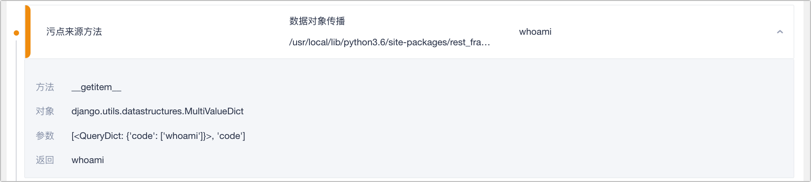
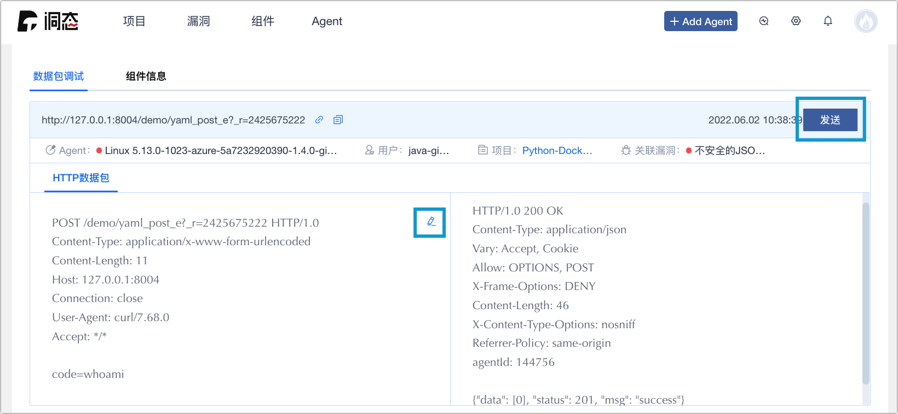

# 应用漏洞

应用漏洞主要用于用户的应用漏洞管理，在上方菜单栏的左边第二个。功能是展示已创建项目所有的漏洞列表、漏洞详情、过滤器、搜索、漏洞验证。

**应用漏洞的功能与项目漏洞的区别是应用漏洞展示所有发现的安全漏洞，其他功能保持一致，不再赘述。**

此单元，会详细介绍漏洞详情（应用漏洞及组件漏洞）和漏洞重放。

## 应用漏洞详情

应用漏洞详情页展示的内容有漏洞基本信息 、漏洞描述、数据流、污点流图、修复建议、运行时环境、运行变量、漏洞状态变更、漏洞验证、漏洞删除和漏洞日志。

### 基本信息

显示漏洞的基本信息

* 危害级别：漏洞的危害级别（高危、中危、低危、提示）。
* 首次出现：第一次检测出安全漏洞的时间。
* 最新活跃：同个位置的漏洞重新被检测出来的时间。
* 漏洞类型：漏洞的类型。
* 项目名称：检测项目的名称。
* 中间件：展示中间件的名称和版本（无法收集到中间时，会返回 unkown）。
* 语言：使用的 Agent 语言。
* 漏洞状态：展示漏洞的当前状态。
    * 待验证：检测到漏洞时的初始状态。
    * 验证中：待 Agent 收集心跳和回传重放数据时的状态。
    * 已确认：重放成功后的漏洞状态。
    * 已忽略：重放失败后的漏洞状态。
    * 已处理：已进行修补的漏洞状态。

:::tip

Agent 开启自动验证功能，会自动重放请求验证漏洞，并按重放结果自动更新漏洞状态。

:::

### 漏洞描述

漏洞类型的相关介绍。

### 数据流

漏洞的 HTTP 请求和响应结果。

### 污点流图

形成漏洞的流程图，记录漏洞最初的来源方法、途径的传播方法以及最终触发漏洞的危险方法。

* 污点源方法规则 ： 使用启发式的策略进行标记，例如把来自程序外部输入的数据统称为`污点数据`。

* 传播方法规则 ： 分析污点标记数据在程序中的传播途径。

* 危险方法规则 ： 危险方法是漏洞出发的位置。

### 修复建议

漏洞的修复建议指南。

### 运行时环境

* 运行时环境：检测项目的应用服务的运行时环境信息。

* 运行时变量：检测项目的应用服务的运行变量信息如：启动命令等。

### 漏洞状态变更

变更漏洞的当前状态（待验证、验证中、已验证、已忽略、已处理）。

### 漏洞验证

点选 🐞 按钮验证此漏洞。

### 漏洞删除

点选 🗑 按钮删除此漏洞。

### 漏洞日志

点选 `查看日志` 查看此漏洞的相关日志，包含检测及状态修改等内容。

## 组件漏洞详情

组件漏洞详情页展示的内容有漏洞基本信息 、漏洞描述、参考及分析文章、漏洞删除和漏洞日志。

* 基本信息：显示漏洞的基本信息

    * 危害级别：漏洞的危害级别（高危、中危、低危、提示）。

    * 首次出现：第一次检测出安全漏洞的时间。

    * 最新活跃：同个位置的漏洞重新被检测出来的时间。

    * 漏洞类型：漏洞的类型。

    * 编号：第三方开源组件的漏洞编号。

    * 可利用性：漏洞能被利用的风险性。

    * 项目名称：使用到此组件的关联项目。

    * 语言：使用的 Agent 语言。

* 漏洞描述：漏洞类型的相关介绍。

* 漏洞删除：删除此漏洞。

* 查看日志：此漏洞的相关日志，包含检测及状态修改等内容。

## 漏洞重放

当检测出应用某接口有安全漏洞后，会向洞态 Agent 发送重放请求，这个重放请求会携带特定的 payload ，去验证该漏洞是否真实存在。

:::tip

* 预设 Agent 会主动发送请求来验证漏洞，此功能可在 Agent 管理中可以启停。

    

* 用户也能在漏洞详情中的数据流，点选请求重放数据包。

    

* 重放的数据包可使用洞态预设或是自定义。

    

* 重放数据包要确保 Agent 是在运行中的状态。

:::

## 相关资源

* [🔗 : 项目漏洞 ](application-management#项目漏洞)
* [🔗 : 污点流图解说（商业版）](https://i0x0fy4ibf.feishu.cn/docs/doccnljZDeCfp0ZVW9XpDOxiRgd)