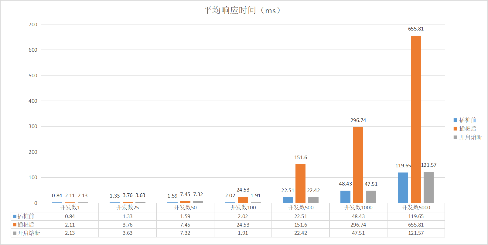
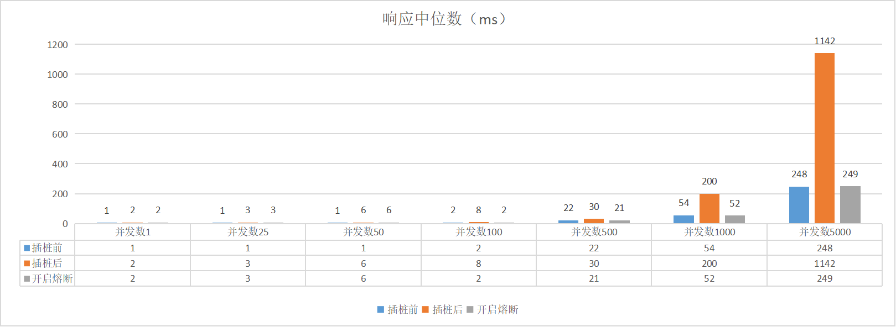
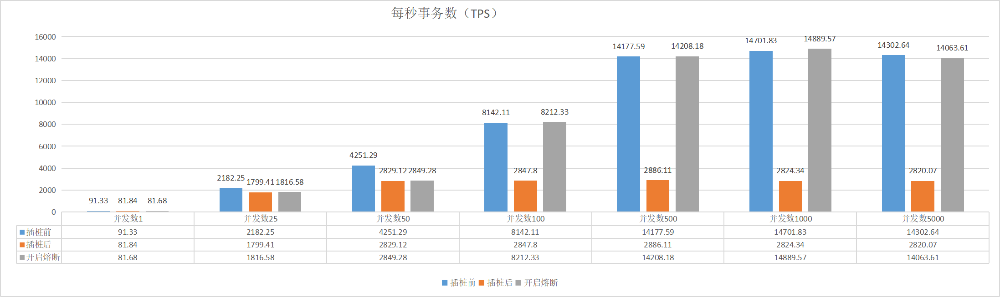
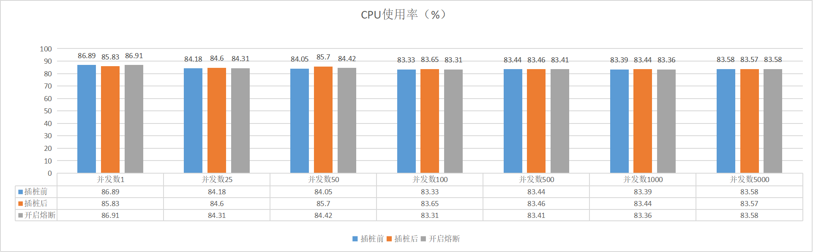

import Highlight from '@site/src/components/Highlight';

# Java Agent

## 背景

洞态 IAST 发布了 1.4.0 版本，Dongtai-Java-Agent 发布了重大功能：`熔断降级`。 

在之前的测试以及用户的反馈中，我们发现了 Dongtai-Java-Agent 在高并发和高频访问数据库的场景下对业务接口响
应时间影响较大，于是熔断降级功能也就应运而生了。

本篇报告记录了洞态 IAST 团队对高并发以及高频访问数据库的场景下进行的性能测试。

## 测试环境

|

 |                                                                                   |
|:------------|:---------------------------------------------------------------------------------------------------------------------|
|Agent 版本 |DongTai-java-agent v1.4.0|
|靶场 |DongTai-JavaAgent-Benchmark| 
|软件配置 |MySQL v5.7, Redis v6.2.5, Jmeter v5.4.1| 
|硬件配置 |16 Intel Core, 32 GB Memory|        
|操作系统 |Ubuntu|                                                                                                                            
## 测试场景

:::note

测试用例： `DongTai-JavaAgent-Benchmark`

此用列包含 `Spring Boot`, `Spring MVC`, `JDBC Template` 和 `Redis Template`。

测试接口会单次查询 MySQL 和多次查询并插入 Redis 数据。
:::

* 并发量: `1`、`25`、`50`、`100`、`500`、`1000`、`5000`

* 测试场景: 未插桩/插桩代理的应用运行

* 测试标准: `平均响应时间`, `响应中位数`, `吞吐量`,`CPU 占用率` and `内存使用`。

### 熔断降级配置

* 单请求 hook 限流：100 次
* 高频流量限流：100 次
* JVM CPU 最大阈值：100 %
* JVM CPU 风险阈值：90 %
* JVM 内存最大阈值：100 %
* JVM 内存风险阈值：90 %

:::info

* 单请求 hook 限流：限制单个请求内每秒hook数量
* 高频流量限流：每秒限制处理请求数量（并发量）
* 最大阈值：占用率超过最大阈值时开始降级
* 风险阈值：占用率多次（默认3次）超过风险阈值时开始降级

:::

## 结果

* 平均响应时间（ms）

* 响应中位数（ms）

* 每秒事务数（TPS）

* CPU使用率（%）

* 内存使用率（%）
 

## 结论

* DongTai IAST <Highlight color="#33A9AC">**轻代理、重服务器**</Highlight> 的架构。代理只负责采集和发送数据，服务器则负责分析与识别漏洞, 并发量增高时，代理对 CPU 和 Memory 的性能影响几乎可以忽略不计。

* DongTai IAST 的理念是构建高效 DevSecOps 流程。 主要用于 <Highlight color="#33A9AC">**开发环境**</Highlight> 和 <Highlight color="#33A9AC">**测试环境**</Highlight> 即只需单次访问即可实行安全检测，并不适用在并发量高的生产环境。

* 在 <Highlight color="#33A9AC">**测试环境**</Highlight> 中，依然会存在对应用进行压力测试的情景，如果在压测时应用依然安装了洞态 IAST 的 Agent，会导致压测结果严重失真。
:::tip
使用 `熔断降级` 功能，设置 `高频流量限流` 可以避免压力测试时 Agent 对业务产生影响。
:::

* 高频访问数据库的接口在安装了 Agent 后导致响应时间过长，是因为对 Hook 点高频访问造成
的。
:::tip
使用 `熔断降级` 功能，设置 `单请求 Hook 限流` 可以针对接口进行限流控制。
:::