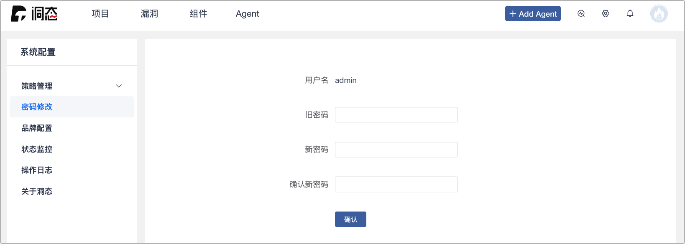
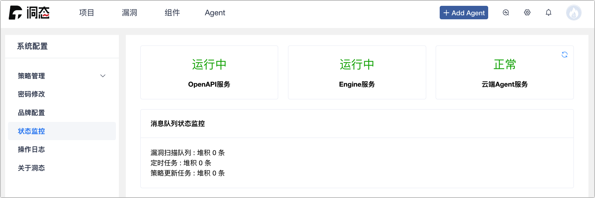

# 系统配置

点选右上角的 ⚙️ 按钮是洞态 IAST 的系统配置，系统配置里包含：策略管理、密码修改、品牌设置、状态监控、操作日志、洞态版本的管理配置。


## 策略管理
策略管理涵盖漏洞检测策略管理、漏洞检测策略模版管理、自定义漏洞检测规则已经敏感信息配置。

### 策略管理


* 用来对漏洞检测时的策略进行管理。

* 策略列表展示了策略名称、策略详情、修复建议、启用状态、设置。

	:::info

	目前已添加的策略有：
	注入（SMTP、Sql、Nosql、Hql、LDAP、XPATH、Header 头、XML 外部实体、表达式、反射）、不安全的随机数、不安全的 XMl Decode、不安全的 hash 算法、不安全的加密算法、不安全的反序列化、不安全的 readline、不安全的转发、不安全的重定向、服务器端请求伪造、命令执行、路径穿越、Cookie-flag 缺失、信任边界、反射型 XSS、、正则表达式 Dos 攻击、动态库加载、SQL 越权类型等。

	:::

### 策略模版管理


* 让用户自定义检测策略模版。

* 快速梳理相关漏洞即可实现漏洞的检测与收敛。

### 自定义规则


* 自定义规则污点源方法规则、传播方法规则、过滤方法规则、危险方法规则进行管理。
	
	* 污点源方法规则 ： 使用启发式的策略进行标记，例如把来自程序外部输入的数据统称为“污点数据”。

	* 传播方法规则 ： 分析污点标记数据在程序中的传播途径。

	* 过滤方法规则 ： 属于传播节点的一种，用于添加公司内部自定义的危险数据过滤方法。

	* 危险方法规则 ： 危险方法是漏洞出发的位置。

* 支持配置 Hook 深度（仅 Hook 当前类、仅 Hook 子类、 Hook 当前类及子类）

#### 主动验证


* 当点击漏洞主动验证 (有 HTTP 请求的中高危漏洞) 的时候，从下列数据库的表中，会出现至少一个或者N个 (N 为 漏洞类型配置的 payload 的 多少) 记录。

``` sql
SELECT * FROM iast_replay_queue irq
WHERE relation_id = <漏洞id> order by id desc ; 
```
:::note 样例

* 主动验证规则配置样例：


* 数据库 iast_replay_queue 表返回结果样例：


*提示：没有配置主动验证规则，`payload_id=-1`*

:::

### 敏感信息配置


* 为了检测敏感信息泄漏的安全风险，需要配置敏感信息的匹配规则及相关的策略。

* 支持 HTTP 请求中请求参数和响应体的检测。

## 密码修改



* 当前用户修改登陆密码。

## 品牌配置


* 在品牌配置中可替换洞态 IAST 的 Logo 以及 Icon 样式。

## 状态监控



* 状态监控用于监控 OpenAPI 和 Engine 状态、更新 Agent 和消息队列状态监控。

## 操作日志


* 状态监控用于监控 OpenAPI 和 Engine 状态、更新探针和消息队列状态监控。

## 关于洞态


* 可在此页面查询 DongTai IAST 当前版本。
