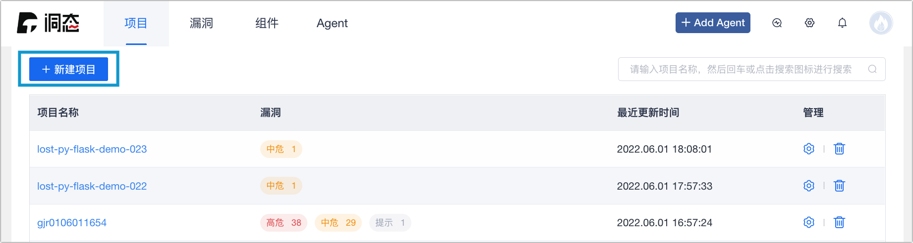
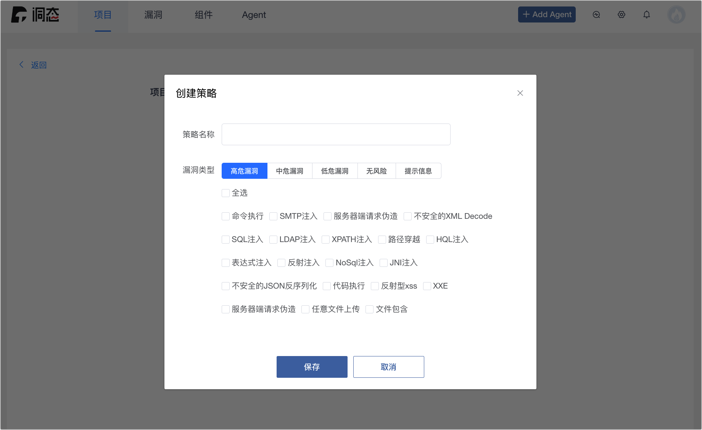
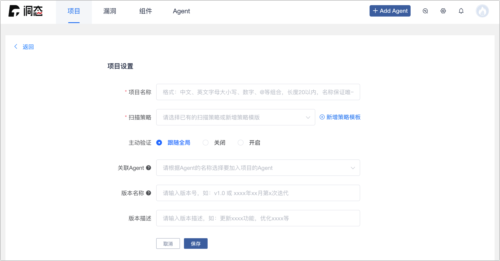
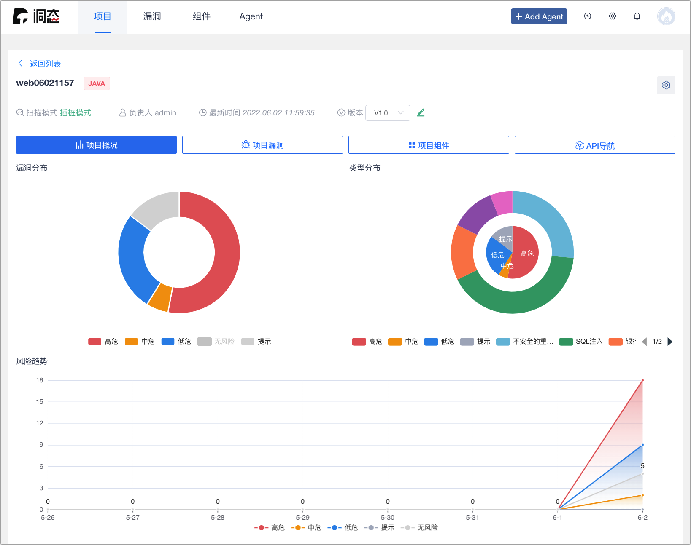
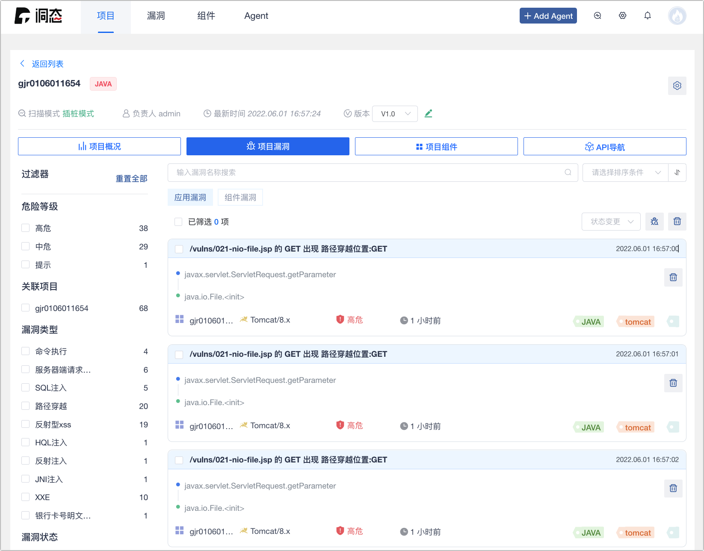
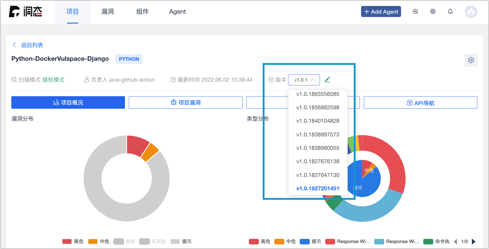

# 项目配置

项目配置主要用于用户的项目管理，在上方菜单栏的左边第一个。功能是展示已创建的项目列表、新建项目、管理项目、搜索项目、项目详情：

## 展示项目

如果用户已经创建项目，将会展示用户的项目信息，展示的信息包含：项目名称、已确认漏洞、最近更新时间、管理。 

## 新建项目

让用户自行新建项目。

* 在页面上方点击新建项目创`建新项目`。

* 点击创建项目按钮后的会换页到新建项目页面。项目名称和扫描策略是必填选项。

    * 项目名称：检测项目的名称。

    * 扫描策略：可使用预设的扫描策略或点选新增策略模版自定义。

* 若有其他配置可点选展开高级设置即可设置关联 Agent、版本号、版本描述、项目地址以及访问凭证配置。

  * 主动验证：主动验证的功能的启停，可按全局或是个别项目进行启停配置。

  * 关联 Agent：通过选择 Agent，将 Agent 绑定至当前项目。

  * 版本名称：项目版本。

  * 版本描述：当前项目版本的描述。

:::tip

关联 Agent 如果不填写该项目会与和项目名称一致的 Agent 自动绑定。

  * 推荐在 Agent 端使用 `-Ddongtai.app.name=项目名称` 参数进行 Agent 与项目的自动绑定。否则预设项目名称为：`Demo Project`。

  * 推荐在 Agent 端使用 `-Ddongtai.app.version=项目版本` 参数指定项目版本。

::: 

* 设置完成后，点击保存项目即创建完成。

## 项目列表

项目列表是展示已创建的项目列表。

## 管理项目

* 点选项目管理中的 ⚙️ 按钮，会跳转至项目设置，可在此管理及修正项目设置。

* 点选项目管理中的 🗑 按钮即可删除项目。 

## 搜索项目

* 搜索项目在项目配置页面右上方，可根据项目名称搜索项目。

## 项目详情

项目详情是点击项目列表中的项目，功能是展示项目的详细信息（项目概述、项目漏洞、项目组件和 API 导航）、项目版本切换和项目设置。 

### 项目概述

* 漏洞分布：漏洞等级直方图，统计漏洞等级和对应数量。

* 类型分布：漏洞类型饼图，统计漏洞类型和对应数量。

* 风险趋势：发现漏洞时间与数量关系折线图，统计漏洞数量和发现时间趋势。

### 项目漏洞

项目漏洞展示了项目下所有漏洞的详细信息，包含漏洞列表，漏洞详情，漏洞排序，过滤器，漏洞验证和漏洞删除功能：

* 漏洞列表展示该项目下所有漏洞，按应用漏洞和组件漏洞区分。

* 漏洞详情展示某个漏洞的详细信息。

* 漏洞排序可以根据`漏洞级别`、`发现时间`、`最新活跃`、`状态`，进行生序或降序排序。

  * 漏洞级别：`高危`、`中危`、`低危`、`提示`。

  * 发现时间：首次检测出漏洞的时间。

  * 最新活跃：同个漏洞再次被检出的时间。

  * 状态：漏洞的状态，分成：`待验证`、`验证中`、`已确认`、`已忽略`、`已处理`。

* 过滤器根据`漏洞类型`、`危险等级`、`语言`、`状态`、`关联项目`进行过滤。

* 漏洞验证对已检测到漏洞进行验证，**此功能需要 Agent 存活下才能操作**。

* 可`单选`或`批量`删除漏洞。

### 项目组件

项目组件展示了项目中使用的组件列表、组件详情、组件排序、过滤器、组件搜索功能：

* 漏洞列表展示该项目下所有组件信息，展示信息有组件名称、组件最高版本（最新版本/当前使用版本）、漏洞数量、关联项目。

* 组件详情展示组件的详细信息。

* 组件排序可根据`风险等级`、`语言`、`漏洞数量`进行排序。

* 过滤器根据`漏洞等级`、`语言`进行过滤。 

### API 导航

API 导航展示项目的 API 列表、API详情、过滤器、搜索的功能。**（只支持 Spring Boot 项目）**

* API 列表展示本项目中所有 API 接口的信息。

* API 详情展示接口的详细信息，包含 API 接口使用到的参数列表。

* 过滤器可以根据`请求方法`、`覆盖状态`进行过滤。

* 搜索根据API地址进行搜索。 

:::tip

* 被覆盖到安全检测的 API 接口后方会有 ☑️ 的标示。

* 检测出有应用安全漏洞的借口会被展示。

* 提供准确的参数名与数据类型，可直接发送 HTTP 请求。

:::

### 项目版本

切换项目的版本以及设置当前展示的项目版本详情。

### 项目设置

管理及修正项目设置，修正后点选保存即可更新项目设置。 

